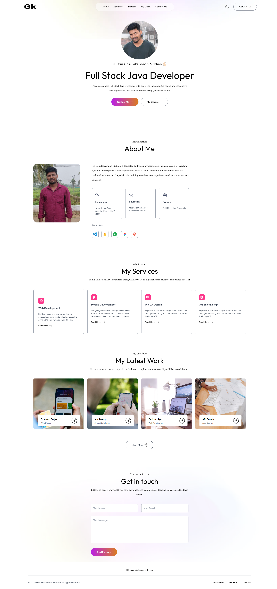
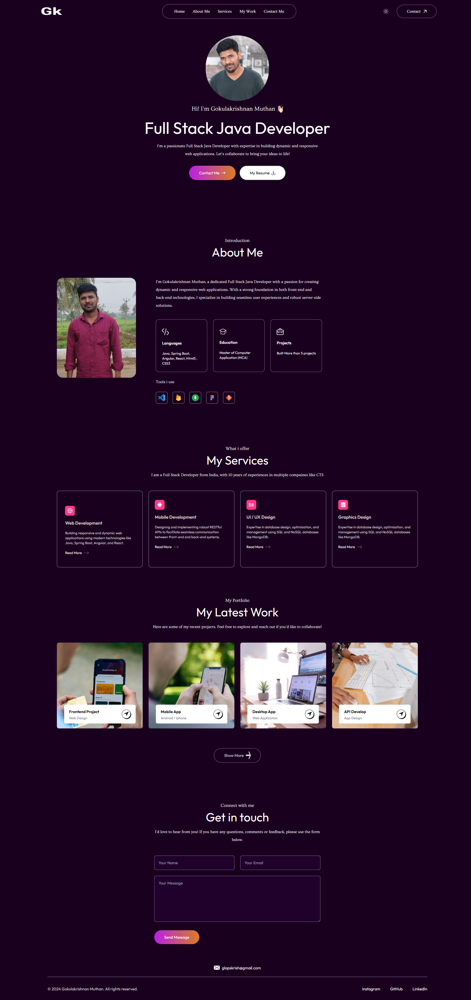

# Personal Portfolio (HTML5)

A clean and responsive personal portfolio website built with **HTML5, CSS3, and JavaScript**.  
This project showcases my skills, projects, and professional journey as a Full Stack Developer.

---
## 👤 About Me

Hi — I’m **Gokulakrishnan**, a full-stack developer passionate about building clean, responsive, and performant websites.  
I created this portfolio to showcase the projects, skills and technologies I work with.  
When I’m not coding, I enjoy exploring new frameworks, learning modern web standards, and contributing to open-source projects.

---

## 🚀 What This Portfolio Is For

- To demonstrate my frontend & full-stack capabilities with HTML5, CSS (Tailwind), and JavaScript.  
- To provide a quick overview of my skills, projects and design / coding style.  
- To serve as a base template that’s easy to extend or customize for future projects.  


## 🚀 Features
- Responsive design for mobile, tablet, and desktop
- Smooth navigation with sections for:
  - About Me
  - Skills
  - Projects
  - Contact
- Simple, lightweight, and fast-loading
- Easy to customize and extend

---

## 🛠️ Tech Stack
- **Frontend:** HTML5, CSS3, JavaScript
- **Deployment:** GitHub Pages / Netlify / Vercel

---

## 📂 Project Structure
---

## 📸 Screenshots
(Add screenshots or GIFs of your portfolio here)



---

## 🔧 Setup & Usage
1. Clone the repository:
   ```bash
   git clone https://github.com/GokulakrishnanMuthan/personal-portfolio-html5.git

